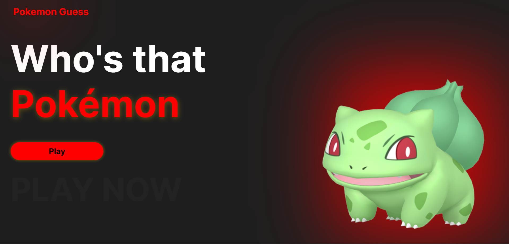
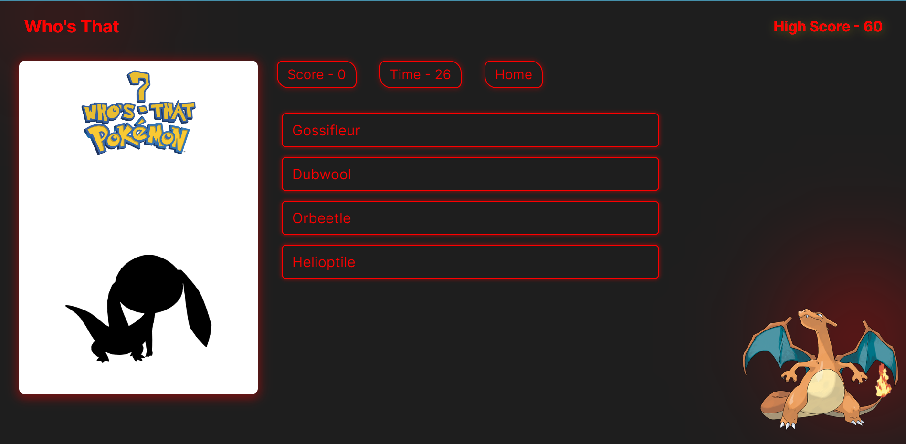
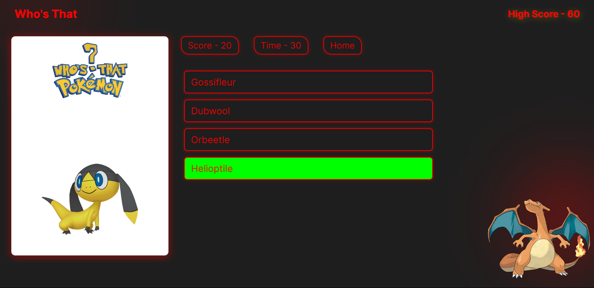
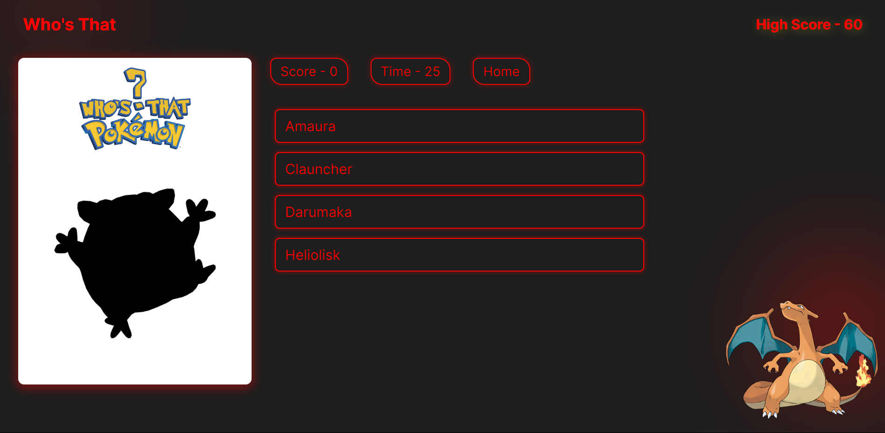
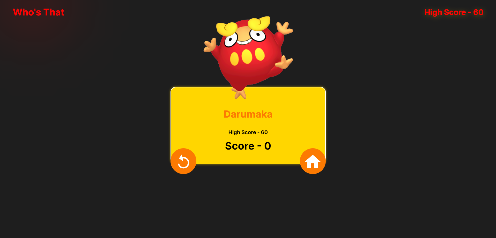

---

# Who's That Pokémon? - ReactJS Web Application

## Description

"Who's That Pokémon?" is an interactive web game built with ReactJS that challenges players to identify Pokémon from their silhouettes. In this engaging and fun game, players are presented with a shadowy outline of a Pokémon and must guess the correct character from multiple-choice options. These options are dynamically fetched from a Pokémon API, providing a wide variety of choices for each round.

## Features

- **Dynamic Gameplay**: Each round presents a new silhouette and multiple-choice options fetched from an API, ensuring fresh content.
- **Scoring System**: Players earn points for each correct answer, promoting a competitive and fun environment.
- **Timer Challenge**: A countdown timer adds urgency to the game, encouraging quick thinking and fast responses.
- **User-Friendly Interface**: Designed with an intuitive layout for a seamless gaming experience.

## Technologies Used

- **ReactJS**: For building the interactive user interface.
- **API Integration**: Fetches Pokémon data to provide diverse gameplay options.

## Demo

You can try the game live [here](https://whosthat-pokemon.vercel.app/).

## Installation

To run the project locally, follow these steps:

1. Clone the repository:
   ```bash
   git clone https://github.com/P1Manav/POKEMON.git
   ```

2. Navigate to the project directory:
   ```bash
   cd POKEMON
   ```

3. Install the dependencies:
   ```bash
   npm install
   ```

4. Start the development server:
   ```bash
   npm start
   ```

---

### Screenshots

---

<p align="center">
  
</p>
<p align="center">
  
</p>
<p align="center">
  
</p>
<p align="center">
  
</p>
## Gameplay Mechanics

- **Correct Answers**: If the player selects the correct option, the game continues, and the player's score increases by 20 points.
- **Incorrect Answers**: If the player selects an incorrect option, the game ends. The correct answer is revealed, and the final score, along with the maximum score achieved during the session, is displayed.
<p align="center">
  
</p>


